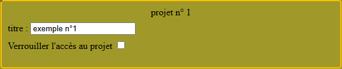
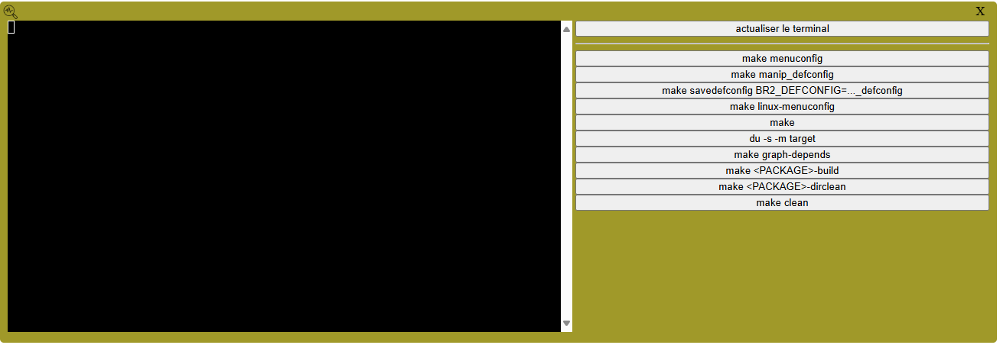

# Manuel d'utilisation du RaspiBuildrootServer

## Supposition préalable

- Supposons que le serveur ait été installé par l'administrateur de l'institution d'enseignement
sous le nom : "**buildroot.institut.fr**".

- Supposons que les comptes créés (et utilisés dans le cadre de ce manuel d'utilisation) sont :
**etudiant1@institut.fr**, **etudiant2@institut.fr**, **etudiant3@institut.fr**
et **professeur1@institut.fr**

- Supposons enfin que la catégorie de projets créée ait pour titre "**Travaux Pratiques**"

## Connexion et accès en groupe de projet au serveur :

1. Se connecter au serveur web par l'URL **https://buildroot.institut.fr/**

On commence par choisir sa langue (français ou anglais), puis on indique son mail de connexion
et son mot de passe initial associé que l'enseignant vous a communiqués.

**Remarque** : *Il est fortement conseillé de changer tout de suite son mot de passe.*

Pour cela, on saisi dans les deux champs " **mot de passe**" en bas du bloc jaune.
Si les deux mots de passe sont bien identiques le bouton "**connexion**" va se désactiver
tandis que le bouton "**changer**" va s'activer.
On peut alors cliquer sur ce dernier pour changer le mot de passe de connexion.
Si le mot de passe d'origine était bien le bon, le nouveau mot de passe se met automatiquement
dans le premier champ de saisie du mot de passe au dessus du bouton "**connexion**".

Il reste simplement à cliquer sur le bouton "**connexion**".

2. Dans chaque groupe, l'étudiant, désigné comme chef de projet, clique sur le titre de
la catégorie spécifiée par l'enseignant à savoir "**Travaux Pratiques**".

L’ensemble des projets de la catégorie s’affiche alors sous le titre de la catégorie.
Cliquez sur le pictogramme (en forme de gros + bleu), correspondant à la création d’un
nouveau projet, situé après l’énumération des projets de cette catégorie.

Lors de cette création, l’interface vous demande, via un popup, d’indiquer un titre
au projet qui permettra de le distinguer de vos autres projets (sans devoir retenir
le numéro d’identification qui lui sera affecté).

Après la création, vous êtes automatiquement membre du projet et vous le retrouverez
dans la liste de vos projets sous la première rubrique.
Vous y retrouvez le numéro identifiant le projet, le titre que vous avez donné au
projet et la liste des prénoms et noms participant au projet.  

Pour l’instant, vous devez être le seul participant et vos collègues retrouveront
désormais le projet dans la liste de la catégorie "**Travaux Pratiques**" tandis que
vous le retrouvez à la fois dans cette liste (encadré par un liseré rouge) et dans
la liste de vos projets.

3. Vous pouvez, à présent, sélectionner le projet sur lequel vous souhaitez travailler.

## Accès aux réglages du projet

La fenêtre de réglages du projet qui s'ouvre quand on sélectionne un projet se
décompose en 5 blocs (4 blocs permaments et un 5ème bloc pour afficher l'historique
du git interne au serveur).

### Bloc d'identification du projet

Ce bloc est situé en haut à gauche de la fenêtre. Et on retrouve, dans ce bloc :
- le numéro du projet,
- le titre que l’on peut modifier en éditant le champ de saisie

    *La sortie du curseur du champ de saisie tient lieu de validation*

- et une case à cocher.

    *Celle-ci permet de verrouiller l’accès de ce projet aux collègues étudiants
    qui n’en sont pas membres, en le faisant disparaître de la liste de sa catégorie.
    Les enseignants verront toujours le projet dans la liste de sa catégorie
    et pourront toujours y accéder.*

**Remarque** : *Bien évidemment, les modifications que vous pourriez faire,
via ce bloc, ne seront pas prises en compte si vous n’êtes pas membres du projet.*

### Bloc de choix de version de Buildroot

Comme il est possible, pour l'enseignant d'installer plusieurs versions de Buildroot
compilées avec des cibles matériel différentes, ce bloc situé en haut à droite de la
fenêtre nous offre la possibilité de choisir la version de Buildroot avec laquelle on
veut travailler actuellement sur le projet.

**Remarque** : *Quand la machine virtuelle aura été démarrer, l'image utilisée dépendra
de ce choix et la liste déroulante se transformera en un simple champ d'affichage
informant sur la version utilisée.
Pour changer de version, il suffira, alors, d'éteindre la machine virtuelle et de profiter
de la transformation inverse du champ d'affichage en liste de choix.*

Ce cadre présente également, pour l'enseignant la possibilité de donner le droit
"expert" pour l'utilisation de toutes les commandes bash depuis ce projet.

Pour un étudiant, le message et la case à cocher, qui suit, ne figurent pas
dans ce cadre. Dans le cas ou un enseignant aurait donné le droit "expert"
au projet, un message en gras l'indiquerait dans ce cadre.
Pour la plupart des utilisations, le droit "expert" n'est pas nécessaire.

### Bloc de gestion des membres

Dans ce troisième bloc, situé en dessous du premier bloc à gauche dans le fenêtre,
on trouve la liste des membres du projet dans laquelle apparait en première ligne
votre login (ou votre courriel de connexion si vous préférez).
Les pictogrammes devant chaque login vont permettre la gestion des autres membres
(ceux qui n’ont pas créé le projet et souhaitent y participer). 

#### Devenir membre d’un projet

- **Exemple** : **etudiant1@institut.fr** ayant créé le projet n°1 voit le cadre comme ceci.
  

Dans la liste des membres du projet, votre adresse électronique apparait
en premier en caractères normaux (indiquant que vous n’avez pas encore accès)
avec le pictogramme, de demande d’accès, 
sur lequel vous allez pouvoir cliquer.

- **Exemple** : **etudiant2@institut.fr** souhaite faire partir du projet n°1
et donc clique sur le pictogramme de demande d'accès alors qu'il voit le cadre
comme ceci.

  

  Après avoir fait la demande, l'affichage du cadre devient alors le suivant.

  

Les autres membres du groupe (dont le créateur), vous voient désormais dans
la liste des membres. Le pictogramme d’accès 
leur permet de vous donner l’autorisation d’entrer et le pictogramme de
suppression  de vous en
refuser l’accès en vous supprimant de la liste).

- **Exemple** : **etudiant1@institut.fr** va pouvoir décider s'il valide
ou refuse la demande de participation de **etudiant2@institut.fr**.

  

  Après validation, l'affichage pour **etudiant2@institut.fr** devient le suivant.

  

**Remarque** : *Les enseignants n’ont pas besoin de votre approbation
pour faire partir de votre groupe.*

### Bloc d'action

Dans ce quatrième bloc, situé à droite dans la fenêtre sous le **bloc de choix de version**,
une fois membre, on y trouvera les boutons permettant de supprimer le projet, de démarrer
ou d’arrêter la machine virtuelle faisant tourner Buildroot dans le cadre de notre projet
et enfin de visualiser le terminal de pilotage de Buildroot.

#### Lancement de la machine virtuelle

Pour allumer le serveur de compilation associé au projet, on appuie sur le bouton suivant :

Une Machine Virtuelle disponible (qui est indépendante de votre numéro de projet et
qui peut donc changer à chaque fois que l’on effectue un nouveau démarrage) charge
la configuration précédemment sauvegardée pour ce projet.

**Remarque** : *Un message en caractère gras indique le numéro de port sftp qu’il
faudra utiliser pour récupérer l’image compilée ou pour y déposer de nouveaux packages
métiers.*

#### Accès à la machine virtuelle

On va ensuite accéder au terminal de pilotage de Buildroot en appuyant sur le bouton suivant :
 

Une nouvelle fenêtre (la fenêtre du terminal) se substitue à la fenêtre de paramétrage du projet.

Cette fenêtre peut, à tout moment, être refermée (en cliquant sur la croix en haut à droite)
pour revenir à la fenêtre de paramétrage du projet.

## Utilisation du terminal de la machine virtuelle

Dans la fenêtre du terminal, on trouve, en partie droite, des boutons permettant de lancer
dans un shell les commandes de Buildroot les plus importantes et en partie gauche le terminal
permettant de visualiser, ou d’interagir avec, l’exécution de la commande.

### Exemple d'utilisation : make menuconfig

Pour accéder au system de configuration, on utilise communément la commande "**make menuconfig**"
de "buildroot". Vous avez accès à cette commande via le bouton de même nom de l’interface.

Après quelques secondes (pendant lesquelles la commande de compilation défile à l’écran),
le menu apparait dans le terminal à gauche de l’interface web.

Pour utiliser le menu, cliquez dans le terminal (le curseur s’active) et utilisez les flèches
du clavier et la touche "entrée" comme pour l'utilisation classique de buildroot.

**Remarque** : *Quand vous exécutez une commande, les boutons de commandes passent
en rouge et repasseront en vert quand la commande sera terminée. Vos binômes de
projet pourront voir et interagir avec la commande (comme vous le faîtes) en
utilisant le bouton "**actualiser le terminal**".*
 
Ils commenceront par voir, en accéléré, l’historique de tous les affichages que
vous avez eu dans votre terminal avant d’arriver à l’affichage synchrone avec la
commande exécutée. Vous pouvez également utiliser ce bouton après une déconnexion
alors qu’une commande était en cours d’exécution. Vous reprenez ainsi l’exécution
de cette commande (si elle n’est pas terminée) ou vous visualisez simplement le
résultat de la dernière commande exécutée par buildroot.

