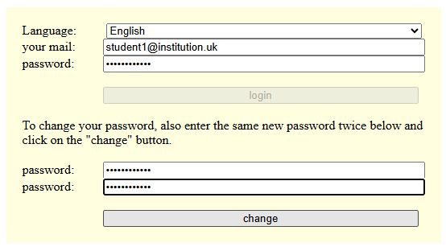
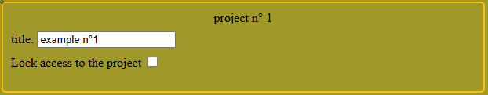
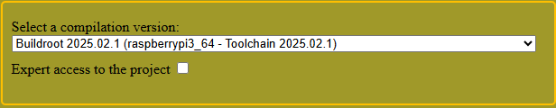

# RaspiBuildrootServer User Manual

## Preliminary assumption

- Let's assume that the server has been installed by the administrator of the educational
institution under the name: "**buildroot.institution.uk**".

- Let's assume that the accounts created (and used for the purposes of this user manual) are:
**student1@institution.uk**, **student2@institution.uk**, **student3@institution.uk**
and **teacher1@institution.uk**

- Finally, let's suppose that the project category created has the title "**Practical work**".

## Project group connection and access to the server:

1. Connect to the web server using the URL **https://buildroot.institution.uk/**

You start by choosing your language (French or English), then enter your login email
and the associated initial password that the teacher has given you.

**Note:** *We strongly advise you to change your password immediately.*

To do this, enter your password in the two fields at the bottom of the yellow block.
If the two passwords are identical, the "**login**" button will be deactivated and
the "**change**" button will be activated.
You can then click on it to change the connection password.
If the original password was the correct one, the new password is automatically
entered in the first password entry field above the "**login**" button.

All you have to do is click on the "**login**" button.

2. In each group, the student, designated as the project leader, clicks on the
title of the category specified by the teacher, i.e. "**Practical work**".

All the projects in the category are then displayed under the category title.
Click on the pictogram (in the shape of a large blue +), corresponding to the
creation of a new project, located after the list of projects in this category.

When you create a project, the interface will ask you, via a popup, to give it
a title that will distinguish it from your other projects (without having
to remember the identification number that will be assigned to it).

Once created, you are automatically a member of the project and you will find it
in the list of your projects under the first heading.
Here you will find the number identifying the project, the title you have given
to the project and the list of first names and surnames involved in the project.

For the time being, you must be the only participant and your colleagues will
now find the project in the list of the "**Practical work**" category, whereas
you will find it both in this list (framed by a red border) and in the list of
your projects.

3. You can now select the project you wish to work on.

## Access to project settings

The project settings window that opens when you select a project is divided
into 5 blocks (4 permanent blocks and a 5th block for displaying the server's
internal git history).

### Project identification block

This block is located at the top left of the window. This block contains :
- the project number,
- the title, which can be changed by editing the input field

    *When the cursor leaves the input field, it is validated.*

- and a tick box.

    *This locks access to the project for student colleagues who are not members,
    by removing it from the list of its category.
    Teachers will still see the project in the list of its category and
    will still be able to access it.*

**Note**: *Obviously, any changes you make via this block will not be taken
into account if you are not a member of the project.*

### Buildroot version selection block

As it is possible for the teacher to install several versions of Buildroot
compiled with different hardware targets, this block at the top right
of the window gives us the option of choosing the Buildroot version
with which we currently want to work on the project.

**Note** : *When the virtual machine has been started, the image used will
depend on this choice and the drop-down list will be transformed into a
simple display field showing the version used. To change version, simply
switch off the virtual machine and take advantage of the inverse transformation
of the display field into a list of choices.*

This framework also gives teachers the option of giving "expert" rights
to use all bash commands from this project.

For a student, the message and the box to be ticked, which follows,
do not appear in this box. If a teacher has given the project "expert" rights,
a message in bold will indicate this in this box.
For most uses, the "expert" right is not necessary.

### Member management block

In this third block, located below the first block on the left of the window,
you will find the list of project members, with your login (or your login email
if you prefer) on the first line. The pictograms in front of each login will
allow you to manage the other members (those who have not created the project
and wish to participate).

#### Devenir membre d’un projet

In the list of project members, your email address appears first in normal font
(indicating that you don't yet have access) with the
 access request pictogram that you
can click on.

The other members of the group (including the creator) will now see you in the
list of members. The  access icon
allows them to give you permission to enter and the
 removal icon allows them to deny
you access by removing you from the list).

**Note** : *Teachers do not need your approval to join your group.*

### Action block

In this fourth block, located on the right-hand side of the window under the
**version choice block**, once you are a member, you will find buttons for
deleting the project, starting or stopping the virtual machine running Buildroot
for our project and finally displaying the Buildroot control terminal.

#### Launching the virtual machine

To switch on the compilation server associated with the project,
press the following button:

An available Virtual Machine (which is independent of your project number and
can therefore change each time you restart) loads the configuration previously
saved for this project.

**Note** : *A message in bold indicates the sftp port number to be used
to retrieve the compiled image or upload new business packages.*

#### Virtual machine access

Next, press the following button to access the Buildroot control terminal:
 

